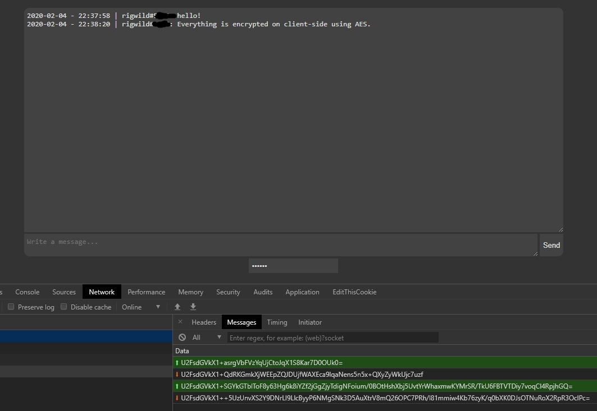

# discord-client-crypted-microservice
A microservice to chat on Discord using client-side encryption (makes MITM SSL proxies useless).

## Install
```sh
git clone https://github.com/rigwild/discord-client-crypted-microservice
cd discord-client-crypted-microservice
yarn
```

## Release build
You can find a version with the front-end already built at the [Releases page](https://github.com/rigwild/discord-client-crypted-microservice/releases).

Keep in mind you still need to [install dependencies](#install).

## Build
You need [Parcel bundler](https://github.com/parcel-bundler/parcel) to build the project.
```sh
yarn global add parcel-bundler
```

You can then build it.
```sh
yarn client:build
```

Or check [Release build](#release-build)

## Configuration
Copy [`.server.env.example`](`.server.env.example`) to `.server.env`.

| Variable | Description |
| -------- | ----------- |
| `secret` | AES secret used to encrypt/decrypt messages, should be long and secure |
| `serverPort` | HTTP/WS port the server will listen on |
| `discordChannelId` | Discord channel ID to chat with |
| `discordToken` | Discord bot (or user) authentication token |

## Start
```sh
yarn server:start
```

## Screenshot


## License
[The MIT License](./LICENSE).
